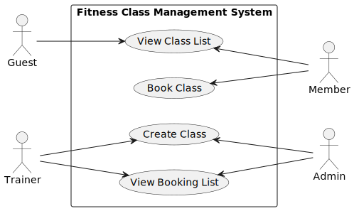

# Requirements Specification

---

# Actors

Based on the meeting, the system has the following actors:

* **Guest**
* **Member**
* **Trainer**
* **Admin**

### Role Clarifications

* Members can book classes. Guests can view classes but must register to book.
* Trainers can create classes.
* Admins have the same permissions as Trainers.
* Admin accounts are created via a token mechanism.
* Role-based authentication is enforced for restricted endpoints.

---

# Use Case Diagram

## Textual Representation

Actors and Use Cases:

* Guest → View Class List
* Member → View Class List, Book Class
* Trainer → Create Class, View Booking List
* Admin → Create Class, View Booking List

## Diagram

---

# Use Case 1: Create Class

## Use Case Name

Create Fitness Class

## Primary Actor

Trainer (Admin has same permissions)

## Preconditions

* User is authenticated.
* User has role Trainer or Admin.
* Required class information is provided.

## Main Success Scenario

1. Actor sends a request to create a new class.
2. System validates input fields.
3. System stores the class in the database.
4. System returns confirmation with class details.

## Alternative Flows

* **Missing Required Fields:**
  System returns 400 Bad Request.

* **Unauthorized User:**
  System returns 403 Forbidden.

## Postconditions

* New class is stored in the system.
* Class is visible in the class list.
* The class is available for members to book.

---

# Use Case 2: View Class List

## Use Case Name

View Class List

## Primary Actor

Guest, Member, Trainer, Admin

## Preconditions

* None (public endpoint unless authentication is enforced later).

## Main Success Scenario

1. Actor requests list of classes.
2. System retrieves classes from the database.
3. System returns list including:

   * Class name
   * Date/time
   * Capacity
   * Available spots
   * Trainer name

## Alternative Flows

* **No Classes Available:**
  System returns empty list.

## Postconditions

* Actor receives accurate list of classes.

---

# Use Case 3: Book Class

## Use Case Name

Book Fitness Class

## Primary Actor

Member

## Preconditions

* Class exists.
* Class is not full.
* User is authenticated as a Member.
* Class is not already booked by the User.

## Main Success Scenario

1. Actor selects a class.
2. System checks availability.
3. System creates booking entry.
4. System decreases available capacity.
5. System confirms booking.

## Alternative Flows

* **Class Full:**
  System returns error message.

* **Duplicate Booking Attempt:**
  System rejects duplicate booking.

* **Class Does Not Exist:**
  System returns 404 Not Found.

## Postconditions

* Booking is stored.
* Capacity is updated.
* The system updates the user’s booking records to include the selected class.
---

# Use Case 4: View Member/Guest List

## Use Case Name

View Booking List for a Class

## Primary Actor

Trainer, Admin

## Preconditions

* User is authenticated.
* User has Trainer or Admin role.
* Class exists.

## Main Success Scenario

1. Actor requests booking list for a specific class.
2. System verifies permissions.
3. System retrieves list of bookings.
4. System returns:

   * User name
   * User type (Member)
   * Booking timestamp

## Alternative Flows

* **Unauthorized Access:**
  System returns 403 Forbidden.

* **Class Not Found:**
  System returns 404 Not Found.

## Postconditions

* Trainer/Admin can view accurate booking list.

---

# Authentication and Authorization

* Token-based authentication will be implemented.
* Role-based access control will restrict:

  * Class creation
  * Viewing booking lists
* Admin accounts are created using a token mechanism.