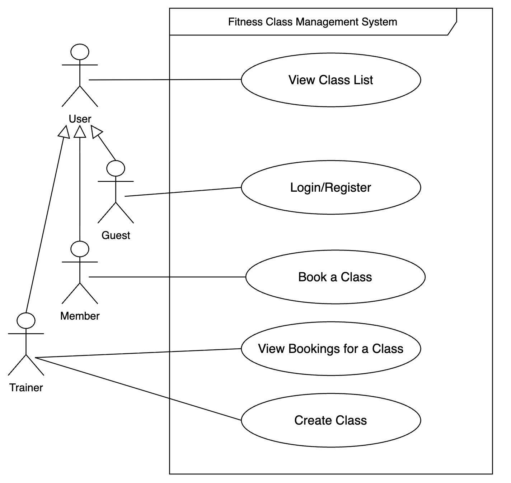

# 1. Requirements Elicitation and Analysis

## Client Meeting Information
- **Date of Meeting:** February 11, 2026 
- **Duration:** 30 minutes

## Elicitation Techniques Used

1. **Structured Interviewing**
   - We prepared an extensive list of functional and non-functional questions.
   - We asked about expected system behavior, edge cases, constraints, and priorities.

2. **Scenario-Based Discussion**
   - We presented hypothetical user scenarios.
   - We asked how the system should respond in different situations.

3. **Use Case Discussion**
   - We discussed the four major system features.
   - We clarified actors and system boundaries.

## Reflection

### (1) Usefulness of Techniques

The structured form of interviewing with pre defined questions was very useful because it ensured we covered all major system aspects and avoided missing key requirements. It also helped uncover edge cases and clarify ambiguous behaviors.

In retrospect, we would improve our process by:
- Bringing wireframes to better visualize system interactions.

### (2) Important Clarification Gained

During the elicitation process, we clarified the distinction between registered members and unregistered guests. The client specified that only registered members should be allowed to book classes, while unregistered users may only view available classes.

This clarification directly impacted our backend design by requiring authentication mechanisms and role-based access to enforce these restrictions. Additionally, the client discussed potential future enhancements involving expanded administrative roles and functionality, which encouraged us to design the system with scalability in mind.

---

# 2. Requirements Specification

## UML Use Case Diagram

### Use Case Specifications

### Feature 1: Create Class

### Feature 2: View Class List

### Feature 3: Book a Class

### Feature 4: View Bookings for a Class

**Use Case:**  View Bookings for a Class 
**Primary Actor:** Trainer  
**Preconditions:** User is authenticated as trainer 

**Main Success Scenario:**
1. Trainer selects a class to view bookings
2. System checks that the selected class exists
3. System retrieves all bookings for selected class
4. System displays the details of members who have booked the class

**Extensions:**
- 2a. If the class selected does not exist, system displays an error message
- 3a. In case of no bookings yet, system displays a placeholder message

**Success guarantee:**
- The system returns the booking list for the selected class

---

